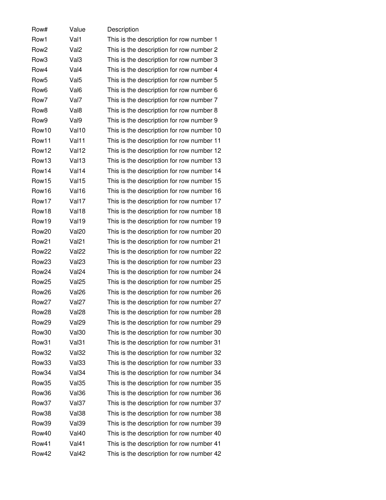
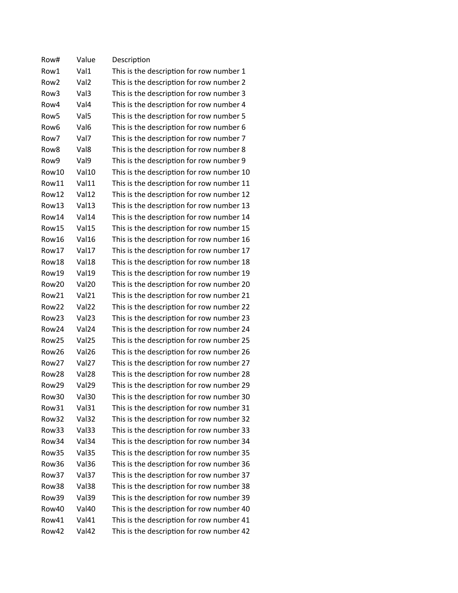
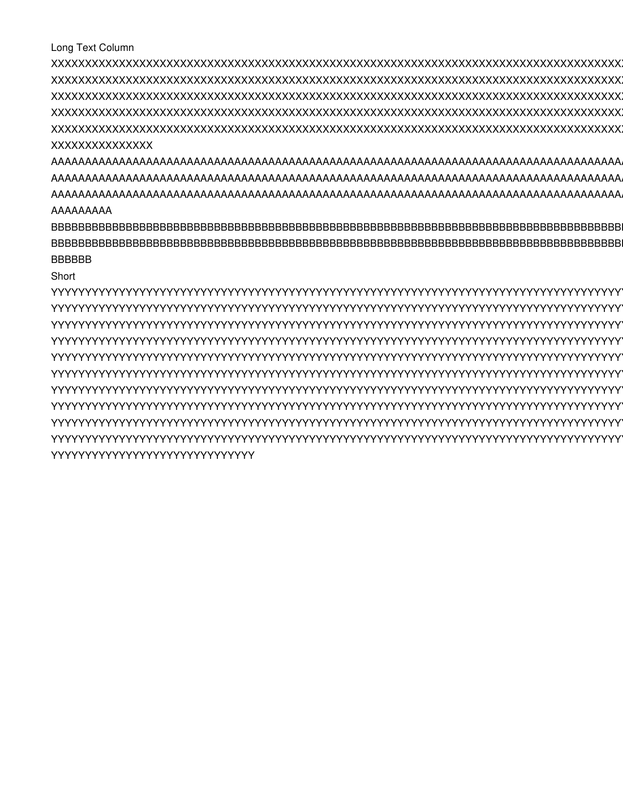
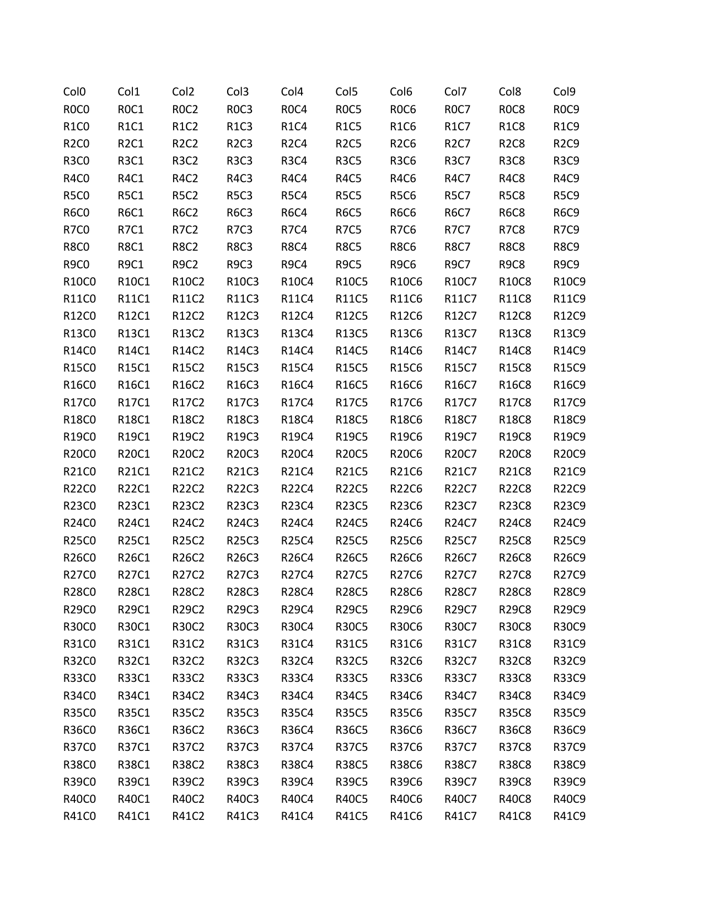
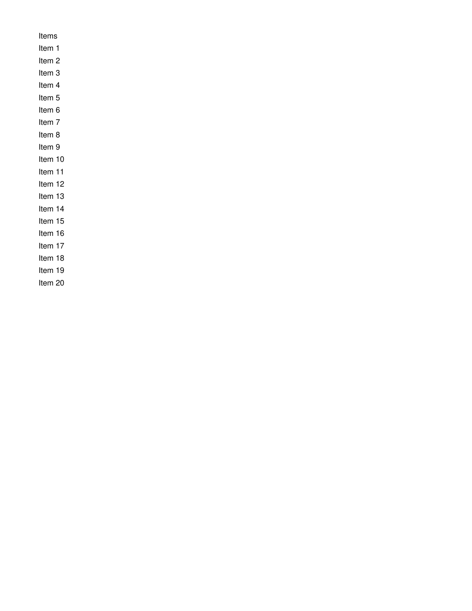
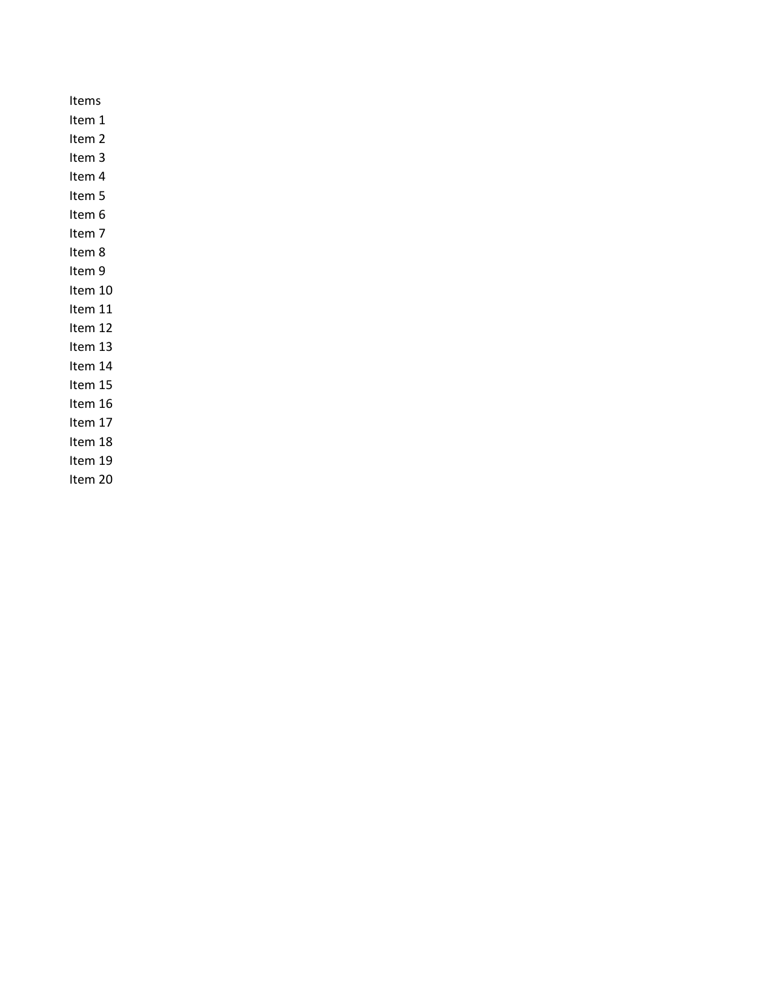

# MiniPdf

A minimal, zero-dependency .NET library for converting Excel (.xlsx) files to PDF.

> **Security**: All PRs are automatically reviewed by Copilot AI and Azure AI security scan for vulnerabilities.

## Features

- **Excel-to-PDF** — Convert `.xlsx` files to paginated PDF with automatic column layout
- **Zero dependencies** — Uses only built-in .NET APIs (no external packages)
- **Valid PDF 1.4** output

## Getting Started

### Install via NuGet

```bash
dotnet add package MiniPdf
```

### Requirements

- .NET 9.0 or later

## Usage

```csharp
using MiniPdf;

// File to file
MiniPdf.ConvertToPdf("data.xlsx", "data.pdf");

// File to byte array
byte[] pdfBytes = MiniPdf.ConvertToPdf("data.xlsx");

// Stream to byte array
using var stream = File.OpenRead("data.xlsx");
byte[] pdfBytes = MiniPdf.ConvertToPdf(stream);
```

## Benchmark

MiniPdf output is compared against LibreOffice as the reference renderer across 30 classic test cases.

| Category | Count | Threshold |
|---|---|---|
| 🟢 Excellent | 25 | ≥ 95% |
| 🟡 Acceptable | 3 | 85% – 95% |
| 🔴 Needs Improvement | 2 | < 85% |

**Average overall score: ~95.4%** (text similarity + visual similarity combined)

### Visual Comparison

All 30 test cases comparing MiniPdf output (left) vs LibreOffice reference (right). Page 1 shown for multi-page results.

<table>
<tr><th>Test Case</th><th>MiniPdf</th><th>LibreOffice (Reference)</th><th>Score</th></tr>
<tr>
  <td><b>classic01</b><br/>Basic table with headers</td>
  <td></td>
  <td></td>
  <td>🟢 97.7%</td>
</tr>
<tr>
  <td><b>classic02</b><br/>Multiple worksheets</td>
  <td></td>
  <td></td>
  <td>🟢 99.3%</td>
</tr>
<tr>
  <td><b>classic03</b><br/>Empty workbook</td>
  <td></td>
  <td></td>
  <td>🟢 100.0%</td>
</tr>
<tr>
  <td><b>classic04</b><br/>Single cell</td>
  <td></td>
  <td></td>
  <td>🟢 100.0%</td>
</tr>
<tr>
  <td><b>classic05</b><br/>Wide table</td>
  <td></td>
  <td></td>
  <td>🟢 99.7%</td>
</tr>
<tr>
  <td><b>classic06</b><br/>Tall table</td>
  <td></td>
  <td></td>
  <td>🟢 95.1%</td>
</tr>
<tr>
  <td><b>classic07</b><br/>Numbers only</td>
  <td></td>
  <td></td>
  <td>🟢 99.9%</td>
</tr>
<tr>
  <td><b>classic08</b><br/>Mixed text and numbers</td>
  <td></td>
  <td></td>
  <td>🟢 99.9%</td>
</tr>
<tr>
  <td><b>classic09</b><br/>Long text<br/><i>MiniPdf: 1 page<br/>Reference: 12 pages</i></td>
  <td></td>
  <td></td>
  <td>🔴 20.3%</td>
</tr>
<tr>
  <td><b>classic10</b><br/>Special XML characters</td>
  <td></td>
  <td></td>
  <td>🟢 99.8%</td>
</tr>
<tr>
  <td><b>classic11</b><br/>Sparse rows</td>
  <td></td>
  <td></td>
  <td>🟢 100.0%</td>
</tr>
<tr>
  <td><b>classic12</b><br/>Sparse columns</td>
  <td></td>
  <td></td>
  <td>🟢 99.9%</td>
</tr>
<tr>
  <td><b>classic13</b><br/>Date strings</td>
  <td></td>
  <td></td>
  <td>🟢 96.8%</td>
</tr>
<tr>
  <td><b>classic14</b><br/>Decimal numbers</td>
  <td></td>
  <td></td>
  <td>🟢 99.3%</td>
</tr>
<tr>
  <td><b>classic15</b><br/>Negative numbers</td>
  <td></td>
  <td></td>
  <td>🟢 99.8%</td>
</tr>
<tr>
  <td><b>classic16</b><br/>Percentage strings</td>
  <td></td>
  <td></td>
  <td>🟢 99.1%</td>
</tr>
<tr>
  <td><b>classic17</b><br/>Currency strings</td>
  <td></td>
  <td></td>
  <td>🟢 97.8%</td>
</tr>
<tr>
  <td><b>classic18</b><br/>Large dataset</td>
  <td></td>
  <td></td>
  <td>🟡 91.5%</td>
</tr>
<tr>
  <td><b>classic19</b><br/>Single column list</td>
  <td></td>
  <td></td>
  <td>🟢 99.7%</td>
</tr>
<tr>
  <td><b>classic20</b><br/>All empty cells</td>
  <td></td>
  <td></td>
  <td>🟢 100.0%</td>
</tr>
<tr>
  <td><b>classic21</b><br/>Header only</td>
  <td></td>
  <td></td>
  <td>🟢 99.9%</td>
</tr>
<tr>
  <td><b>classic22</b><br/>Long sheet name</td>
  <td></td>
  <td></td>
  <td>🟢 99.9%</td>
</tr>
<tr>
  <td><b>classic23</b><br/>Unicode text</td>
  <td></td>
  <td></td>
  <td>🟡 86.4%</td>
</tr>
<tr>
  <td><b>classic24</b><br/>Red text</td>
  <td></td>
  <td></td>
  <td>🟢 99.4%</td>
</tr>
<tr>
  <td><b>classic25</b><br/>Multiple colors</td>
  <td></td>
  <td></td>
  <td>🟢 99.3%</td>
</tr>
<tr>
  <td><b>classic26</b><br/>Inline strings</td>
  <td></td>
  <td></td>
  <td>🟢 99.9%</td>
</tr>
<tr>
  <td><b>classic27</b><br/>Single row</td>
  <td></td>
  <td></td>
  <td>🟢 99.9%</td>
</tr>
<tr>
  <td><b>classic28</b><br/>Duplicate values</td>
  <td></td>
  <td></td>
  <td>🟢 99.8%</td>
</tr>
<tr>
  <td><b>classic29</b><br/>Formula results</td>
  <td></td>
  <td></td>
  <td>🟡 86.8%</td>
</tr>
<tr>
  <td><b>classic30</b><br/>Mixed empty and filled sheets</td>
  <td></td>
  <td></td>
  <td>🟢 99.9%</td>
</tr>
</table>

## License

MIT
